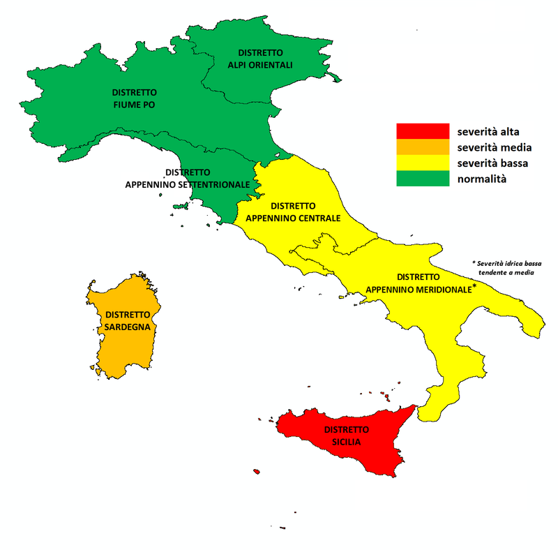

# Lo stato di severità idrica a scala nazionale

La [**pagina web**](https://www.isprambiente.gov.it/pre_meteo/idro/SeverIdrica.html) dell'**ISPRA** (Istituto Superiore per la Protezione e la Ricerca Ambientale) offre una visione sullo stato di severità idrica a scala nazionale in Italia, basata sulle valutazioni degli Osservatori distrettuali permanenti per gli utilizzi idrici.

<!-- more -->

Le attività degli [**Osservatori distrettuali permanenti per gli utilizzi idrici**](https://www.isprambiente.gov.it/pre_meteo/idro/idro.html#osservatori) fanno riferimento alle situazioni corrispondenti a diversi scenari di severità idrica così individuati:

  - **situazione normale** ossia **scenario non critico**, in cui i valori degli indicatori di crisi idrica (portate/livelli/volumi/accumuli) sono tali da prevedere la capacità di soddisfare le esigenze idriche del sistema naturale e antropico, nei periodi di tempo e nelle aree considerate;
  - **scenario di severità idrica bassa**: in cui la domanda idrica è ancora soddisfatta, ma gli indicatori mostrano un trend peggiorativo, le previsioni climatiche mostrano ulteriore assenza di precipitazione e/o temperature eccedenti i valori ordinari per il periodo successivo;
  - **scenario di severità idrica media**: lo stato di criticità si intensifica in quanto le portate in alveo risultano inferiori alla media, la temperatura elevata determina un fabbisogno idrico superiore alla norma, i volumi accumulati negli invasi e nei serbatoi non sono tali da garantire gli utilizzi idropotabili, irrigui, industriali e ambientali con tassi di erogazione standard. Sono probabili danni economici e impatti reversibili sull'ambiente;
  - **scenario di severità idrica alta**: sono state prese tutte le misure preventive ma prevale uno stato critico non ragionevolmente prevedibile, nel quale **la risorsa idrica non risulta sufficiente a evitare danni al sistema**, anche irreversibili. Sussistono le condizioni per la dichiarazione dello stato di siccità prolungata ai sensi dell'art. 4.6 della [**Direttiva Quadro sulle Acque 2000/60/CE**](https://www.mite.gov.it/sites/default/files/direttive-acque/direttiva_2000-60-ce.pdf) (Water Framework Directive 2000/60/EC) o, in casi più gravi, per l'eventuale richiesta, da parte delle Regioni interessate, della dichiarazione dello stato di emergenza nazionale, ai sensi della L. 225/1992, come modificata dalla L. 100/2012, e secondo quanto previsto dalla Dir. PCM 26 ottobre 2012.

È un'ulteriore pagina per **seguire** anche quello che avviene in **Sicilia**. Qui l'"Osservatorio del Distretto idrografico della Sicilia" - in data 8 maggio 2024 -  ha confermato uno **stato di severità ALTA**.

